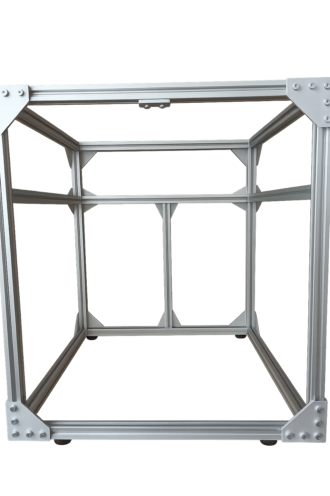
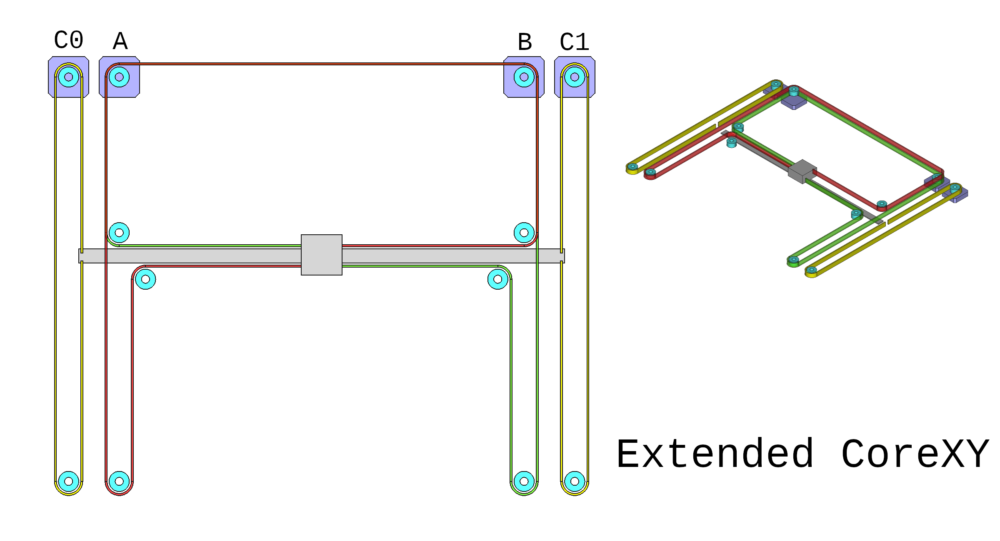

# Olli-Doozer
## A (extended/hybrid-idex) CoreXY Printer 

__Status: Proof of concept, first build__

- Custom CoreXY 235x235x250 with inverted belt path
- Rigid frame, 2020 b-type nut6 extrusions, blind joints
- POWGE idlers & pulleys
- Shoulder Screws as Idler rods
- Independent triple Z

- Belts: length ~1700mm

- Initial build

