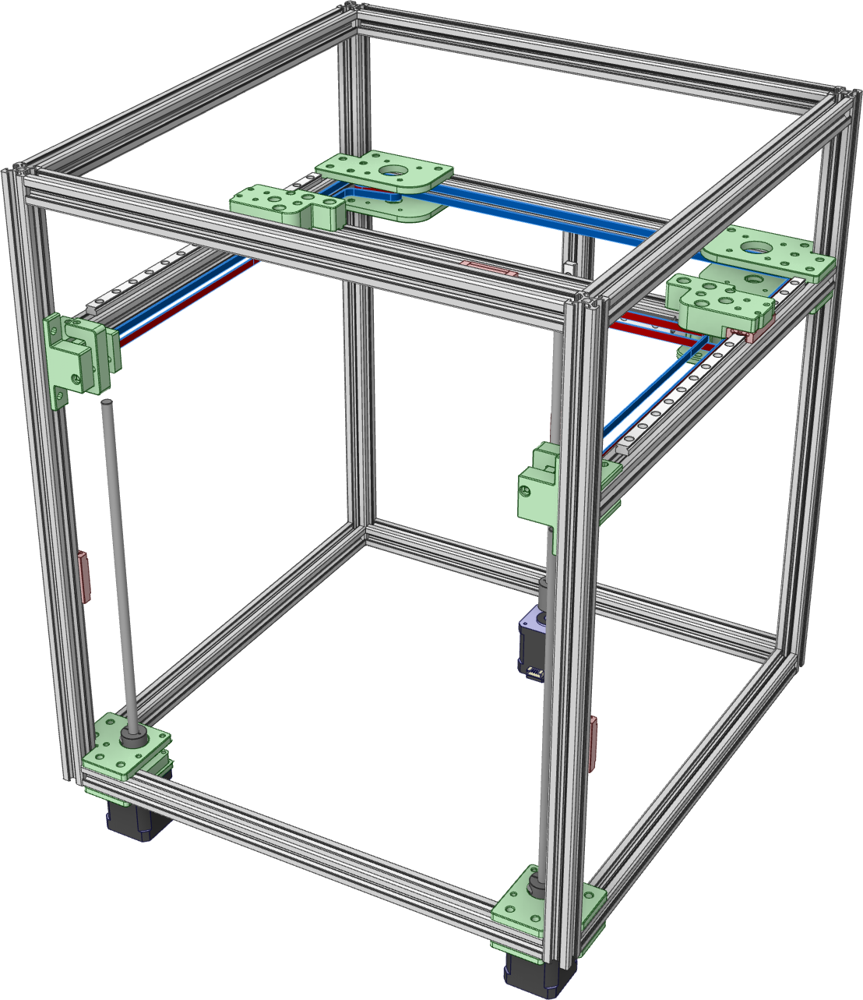

# Olli-Doozer - The angry gnu
## A (extended/hybrid-idex) CoreXY Printer 

__Status: Proof of concept, first build__

- Custom CoreXY 235x235x220 with inverted belt path
- Rigid frame, 2020 b-type nut6 extrusions, blind joints
- POWGE idlers & pulleys
- Shoulder Screws as Idler rods
- Independent triple Z, T8x4 leads crews with Oldham Couplers for lead screw nuts
- z motors with pillow blocks using F8-16M Thrust Ball Bearings and rigid couplers
- Creality K1 heatbed (for now)

- Pillow Block with F8-16M Thrust Ball Bearing

- Belts: length ~1700mm

- Initial build

